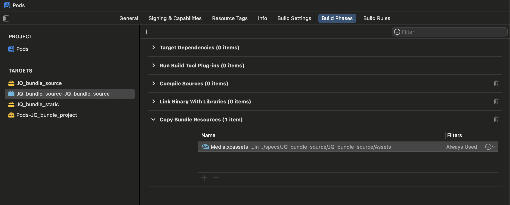
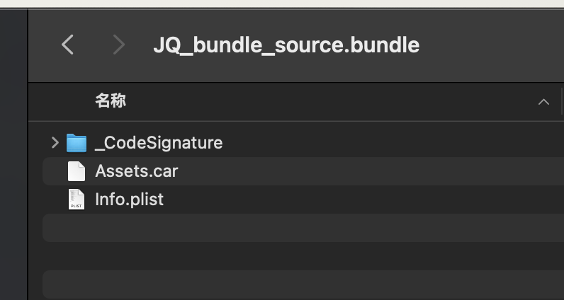

# CocoaPods管理iOS资源

在大型模块化项目中每个模块都有自己的资源，iOS通常通过CocoaPods去管理资源，将各个模块的资源在整包构建时候进行构建和复制  

## .podspec声明资源引入的方式

### s.resources
只是简单的复制到产物中

```ruby
s.resources = ['JQ_bundle_static/JQ_bundle_static.bundle', 'JQ_bundle_static/Assets/*']
```
资源文件将通过脚本Pods-xxx-resources.sh脚本复制到项目中, 可以看到路径是资源的目录 **${PODS_ROOT}/../specs/**
```shell
....
install_resource()
{
    ....
}
install_resource "${PODS_ROOT}/../specs/JQ_bundle_static/JQ_bundle_static/JQ_bundle_static.bundle"
install_resource "${PODS_ROOT}/../specs/JQ_bundle_static/JQ_bundle_static/Assets/2.png"
....
```

在项目里面可以直接通过mainbundle获取
```objc
UIImage *mainImage = [UIImage imageNamed:@"2"];
UIImage *mainImage = [UIImage imageNamed:@"2" inBundle:[NSBundle mainBundle] withConfiguration:nil];
```

使用s.resources直接将资源复制到产物中会使得整个资源的管理比较混乱，由于目前都是模块化管理方式，资源名可能存在重复

### s.resource_bundles
会将对应的资源打包成bundle，然后在复制到产物中
```ruby
s.resource_bundles = {
    'JQ_bundle_source' => ['JQ_bundle_source/Assets/*']
  }   
```
CocoaPods会给其创建独立的target单元配置，还会将xcassets文件编译成car文件



资源文件将通过脚本Pods-xxx-resources.sh脚本复制到项目中, 可以看到路径是bundle编译的产物路径 **${PODS_CONFIGURATION_BUILD_DIR}...**

```shell
install_resource()
{
    ....
}
install_resource "${PODS_CONFIGURATION_BUILD_DIR}/JQ_bundle_source/JQ_bundle_source.bundle"
....
```


在项目里面需要指定bundle名称获取资源
```objc
NSBundle *bundle = [NSBundle bundleWithPath:[[NSBundle mainBundle] pathForResource:bundleName ofType:@"bundle"]];
UIImage *bundleImage = [UIImage imageNamed:@"1" inBundle:bundle withConfiguration:nil];
```
s.resource_bundles方式cocoaPods会将指定的资源打包进单独的bundle之中，是在模块化大型项目中更合适的处理资源的方式

## cocoaPods模块化项目中对资源的处理
在模块化项目中由于各个模块独立开发，特别是大型项目中，业务开发者很难去关注自己模块的资源问题，包括 **引入了较大图片**， **图片尚且有可压缩的空间**， **引入的图片在别的模块已经存在**等，所以在进行整包构建时候有必要项目产物的资源图片进行一些列的处理，以优化包大小和确保项目的稳定性，方式包括
1. 找出资源管理不规范的模块
2. 对每个模块资源大小进行统计
3. 对图片进行无损压缩，并找出过大资源文件
4. 找出可能的相似图片

### 找出资源管理不规范的模块
在大型的项目中一般不希望模块的资源直接copy在产物的一级目录中，因为这样使得产物目录混乱并且不能很清晰的表现处资源属于哪个模块  **类似于下面这种podspec写法** 不推荐
```
s.resources = ['module/images/*']
```
要检测出这些不规范的模块可以直接扫描cocoaPods缓存里模块对应的podspec文件，也可以直接通过Pods-xxx-resources.sh获取到install_resource的所有文件过滤筛出, **在build phases添加下面类似脚本即可**

```shell
path="`pwd`/Pods/Target Support Files/Pods-JQ_bundle_project/Pods-JQ_bundle_project-resources.sh"
grep -E "install_resource" "$path" | while read -r line; do
    path=$(echo "$line" | sed -E 's/.*install_resource "(.+)"/\1/')
    filename=$(basename "$path")
    extension="${filename##*.}"
    if [ "$extension" != "bundle" ]; then
        echo "invalid path: $path"
    fi
done
```
### 对每个模块资源大小进行统计
统计大小并不能精确，一方面因为通常Asset文件最终经过压缩编译成.car，另外一方面有多x图片时候实际上在特定机型上只会安装一种，但是计算出资源大小的变化以控制包大小增长, 直接扫描产物目录即可
```shell
find "$BUILT_PRODUCTS_DIR" -name "*.bundle" | while read -r file; do
    size=$(du -h "$file" | cut -f1)
    filename=$(basename "$file")
    echo "Bundle: $filename, Size: $size"
done
```
在获取到当次资源大小后，可以和之前作为对比，最终输出一份报告

### 对图片进行无损压缩，并找出过大资源文件
现在大型项目里都是二进制化模块，如果模块的bundle本来就已经编译成.car，则图片无法在压缩；整个团队模块可以在整包构建统一压缩之后编译成.car，这样方便统一管理

```shell

compile_xcassets() {
    local xcassets_path="$1"
    local output_car="$2"

    echo "Compiling .xcassets file: $xcassets_path"
    xcrun actool --output-format human-readable-text --notices --warnings --export-dependency-info build/asset_dependencies.plist --output-partial-info-plist build/asset_partial_info.plist --compress-pngs --compile "$output_car" "$xcassets_path"
}

find "$BUILT_PRODUCTS_DIR" -name "*.bundle" | while IFS= read -r bundle; do
    find "$bundle" -name "*.png" -print0 | while IFS= read -r -d '' png; do
        echo "Found PNG file: $png"
        # 压缩图片
    done
    xcassets_files=$(find "$bundle" -name "*.xcassets")
    for xcassets in $xcassets_files; do
        car_output="${bundle}/${xcassets##*/}.car"
        compile_xcassets "$xcassets" "$car_output"
    done
done
```

### 找出可能的相似图片