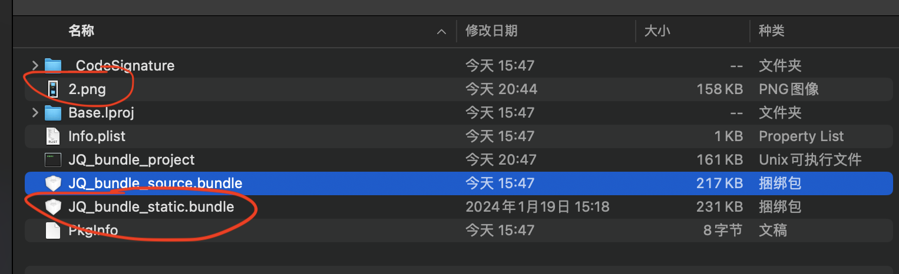

# CocoaPods管理iOS资源

在大型模块化项目中每个模块都有自己的资源，iOS通常通过CocoaPods去管理资源，将各个模块的资源在整包构建时候进行构建和复制  

## .podspec声明资源引入的方式

### s.resources
只是简单的复制到产物中

```ruby
s.resources = ['JQ_bundle_static/JQ_bundle_static.bundle', 'JQ_bundle_static/Assets/*']
```
资源文件将通过脚本Pods-xxx-resources.sh脚本复制到项目中, 可以看到路径是资源的目录 **${PODS_ROOT}/../specs/**
```shell
....
install_resource()
{
    ....
}
install_resource "${PODS_ROOT}/../specs/JQ_bundle_static/JQ_bundle_static/JQ_bundle_static.bundle"
install_resource "${PODS_ROOT}/../specs/JQ_bundle_static/JQ_bundle_static/Assets/2.png"
....
```

在项目里面可以直接通过mainbundle获取
```objc
UIImage *mainImage = [UIImage imageNamed:@"2"];
UIImage *mainImage = [UIImage imageNamed:@"2" inBundle:[NSBundle mainBundle] withConfiguration:nil];
```

使用s.resources直接将资源复制到产物中会使得整个资源的管理比较混乱，由于目前都是模块化管理方式，资源名可能存在重复

### s.resource_bundles
会将对应的资源打包成bundle，然后在复制到产物中
```ruby
s.resource_bundles = {
    'JQ_bundle_source' => ['JQ_bundle_source/Assets/*']
  }   
```
CocoaPods会给其创建独立的target单元配置，还会将xcassets文件编译成car文件


资源文件将通过脚本Pods-xxx-resources.sh脚本复制到项目中, 可以看到路径是bundle编译的产物路径 **${PODS_CONFIGURATION_BUILD_DIR}...**

```shell
install_resource()
{
    ....
}
install_resource "${PODS_CONFIGURATION_BUILD_DIR}/JQ_bundle_source/JQ_bundle_source.bundle"
....
```


在项目里面需要指定bundle名称获取资源
```objc
NSBundle *bundle = [NSBundle bundleWithPath:[[NSBundle mainBundle] pathForResource:bundleName ofType:@"bundle"]];
UIImage *bundleImage = [UIImage imageNamed:@"1" inBundle:bundle withConfiguration:nil];
```
s.resource_bundles方式cocoaPods会将指定的资源打包进单独的bundle之中，是在模块化大型项目中更合适的处理资源的方式

## cocoaPods模块化项目中对资源的处理
在模块化项目中由于各个模块独立开发，特别是大型项目中，业务开发者很难去关注自己模块的资源问题，包括 **引入了较大图片**， **图片尚且有可压缩的空间**， **引入的图片在别的模块已经存在**等，所以在进行整包构建时候有必要项目产物的资源图片进行一些列的处理，以优化包大小和确保项目的稳定性，方式包括
1. 找出资源管理不规范的模块
2. 对每个模块资源大小进行统计
3. 对图片进行无损压缩，并找出过大资源文件
4. 找出可能的相似图片